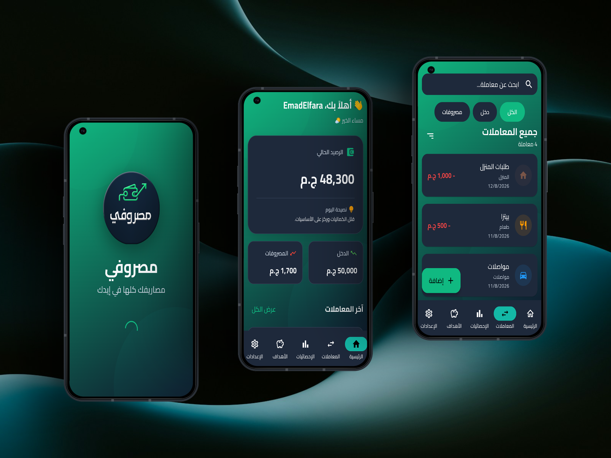
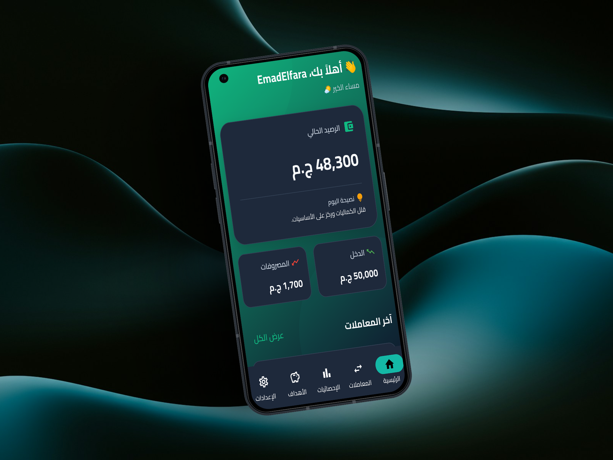
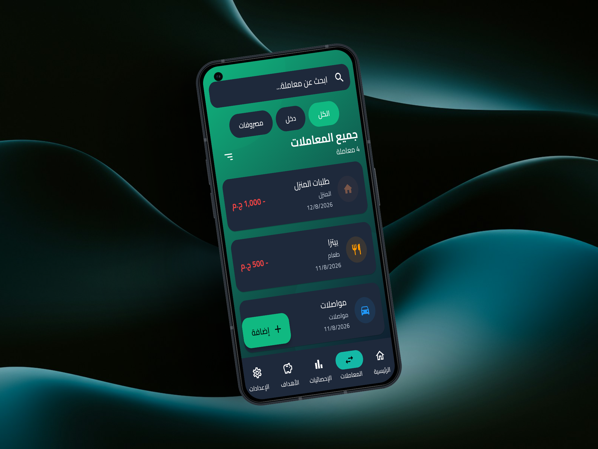
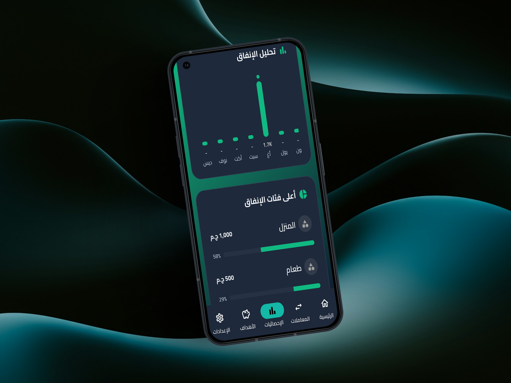
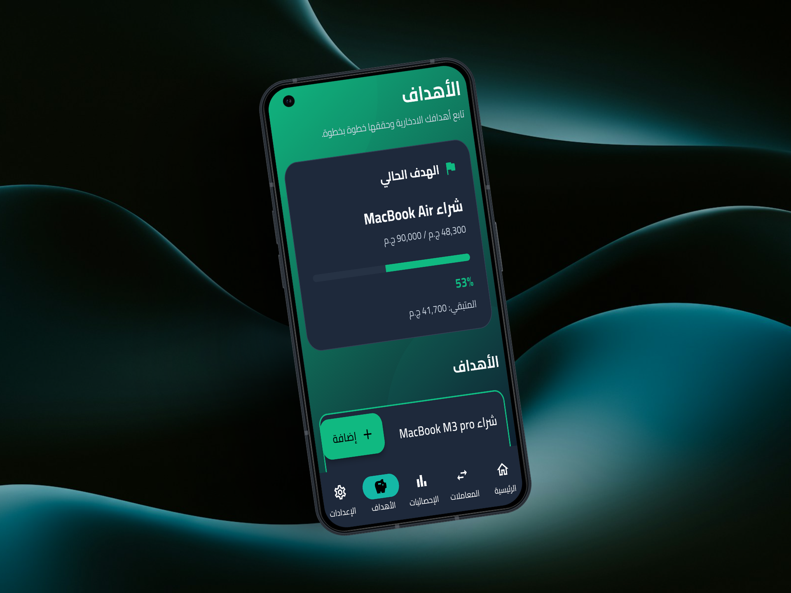
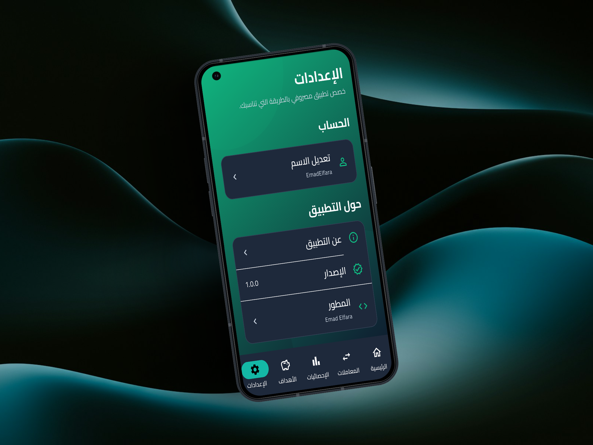
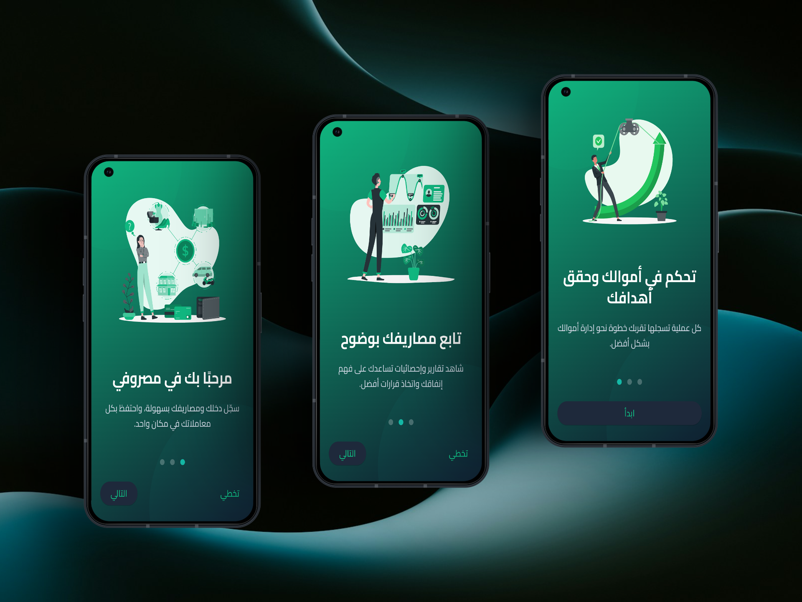

# 💰 Masrofy

## مديرك المالي الشخصي

### Personal Finance Manager

---

## 🇪🇬 العربية

### 📖 نبذة

**مصروفي** هو تطبيق لإدارة الأموال الشخصية يساعدك على التحكم الكامل في دخلك ومصروفاتك وأهدافك المالية بطريقة بسيطة وسريعة.

يعتمد التطبيق على التخزين المحلي بالكامل، لذلك يعمل بدون الحاجة إلى اتصال بالإنترنت.

---

### ✨ المميزات

- 💵 إدارة الدخل والمصروفات
- 🎯 إنشاء ومتابعة أهداف الادخار
- 📊 إحصائيات ورسوم بيانية
- 🏷️ تصنيفات مخصصة
- 🌙 الوضع الداكن
- 💾 قاعدة بيانات محلية باستخدام Drift
- ⚡ واجهة حديثة وسريعة
- 🇪🇬 دعم كامل للغة العربية

---

### 🛠️ التقنيات المستخدمة

- Flutter
- Dart
- Riverpod
- Drift Database
- Material 3

---

### 🚀 تشغيل المشروع

لتشغيل المشروع محليًا:

    flutter pub get
    flutter run

---

## 📂 هيكل المشروع

    lib/
    ├── app/
    │   ├── masrofy_app.dart
    │   └── app_shell.dart
    │
    ├── core/
    │   ├── constants/
    │   ├── database/
    │   ├── formatters/
    │   ├── mappers/
    │   ├── models/
    │   ├── providers/
    │   ├── repositories/
    │   ├── theme/
    │   ├── utils/
    │   └── widgets/
    │
    ├── features/
    │   ├── home/
    │   ├── transactions/
    │   ├── stats/
    │   ├── nickname/
    │   ├── goals/
    │   ├── settings/
    │   ├── onboarding/
    │   └── splash/
    │
    └── main.dart

---

## 📱 صور التطبيق

| Splash | Home | Transactions |
| ------ | ---- | ------------ |
|  |  |  |

| Statistics | Goals | Settings |
| ---------- | ----- | -------- |
|  |  |  |

| Onboarding | Nickname |
| ---------- | -------- |
|  |  |

---
### 🗺️ خارطة الطريق

#### الإصدار الأول (V1)

- ✅ Splash Screen
- ✅ Onboarding
- ✅ الصفحة الرئيسية
- ✅ إدارة المعاملات
- ✅ الإحصائيات
- ✅ أهداف الادخار
- ✅ الإعدادات
- ✅ قاعدة بيانات محلية باستخدام Drift
- ✅ إدارة التصنيفات
- ✅ الوضع الداكن
- ✅ دعم اللغة العربية

#### الإصدار الثاني (V2)

- ⏳ النسخ الاحتياطي
- ⏳ الإشعارات
- ⏳ التخطيط المالي
- ⏳ تصدير التقارير
- ⏳ مزامنة البيانات

---

## 🇺🇸 English

## 📖 About

**Masrofy** is a modern personal finance application built with Flutter.

It helps users manage their income, expenses, savings goals, transactions, and financial statistics while keeping all data stored locally on the device.

The application follows an **Offline-First** approach, allowing users to manage their finances without an internet connection.

---

### ✨ Features

- 💵 Income & Expense Tracking
- 🎯 Savings Goals
- 📊 Financial Statistics
- 🏷️ Custom Categories
- 🌙 Dark Theme
- 💾 Local Database using Drift
- ⚡ Modern Material 3 UI
- 📱 Offline-First Architecture
- 🇪🇬 Full Arabic Support

---

### 🛠️ Tech Stack

- Flutter
- Dart
- Riverpod
- Drift Database
- Material 3

---

### 🚀 Getting Started

To run the project locally:

    flutter pub get
    flutter run

---

## 📂 Project Structure

    lib/
    ├── app/
    │   ├── masrofy_app.dart
    │   └── app_shell.dart
    │
    ├── core/
    │   ├── constants/
    │   ├── database/
    │   ├── formatters/
    │   ├── mappers/
    │   ├── models/
    │   ├── providers/
    │   ├── repositories/
    │   ├── theme/
    │   ├── utils/
    │   └── widgets/
    │
    ├── features/
    │   ├── home/
    │   ├── transactions/
    │   ├── stats/
    │   ├── nickname/
    │   ├── goals/
    │   ├── settings/
    │   ├── onboarding/
    │   └── splash/
    │
    └── main.dart

---

## 📱 Screenshots

| Splash | Home | Transactions |
| ------ | ---- | ------------ |
|  |  |  |

| Statistics | Goals | Settings |
| ---------- | ----- | -------- |
|  |  |  |

| Onboarding | Nickname |
| ---------- | -------- |
|  |  |

---
## 🗺️ Roadmap

### Version 1

- ✅ Splash Screen
- ✅ Onboarding
- ✅ Home
- ✅ Transactions
- ✅ Statistics
- ✅ Savings Goals
- ✅ Settings
- ✅ Local Database
- ✅ Custom Categories
- ✅ Dark Theme
- ✅ Arabic Language Support

### Version 2

- ⏳ Cloud Backup
- ⏳ Notifications
- ⏳ Financial Planning
- ⏳ Export Reports
- ⏳ Data Synchronization

---

## 👨‍💻 Developer

Developed with ❤️ by **Emad Elfara**

---

## 📄 License

This project is licensed under the MIT License.
